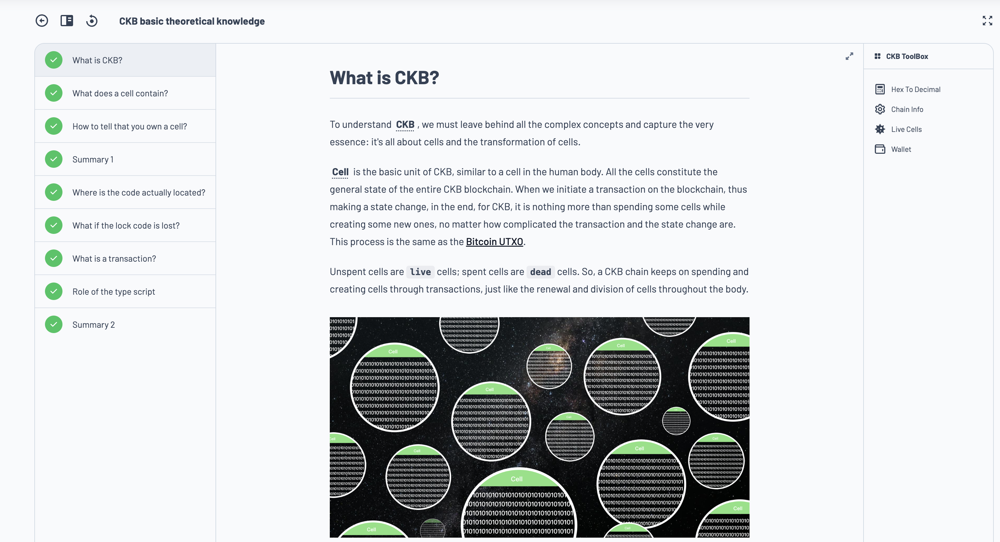
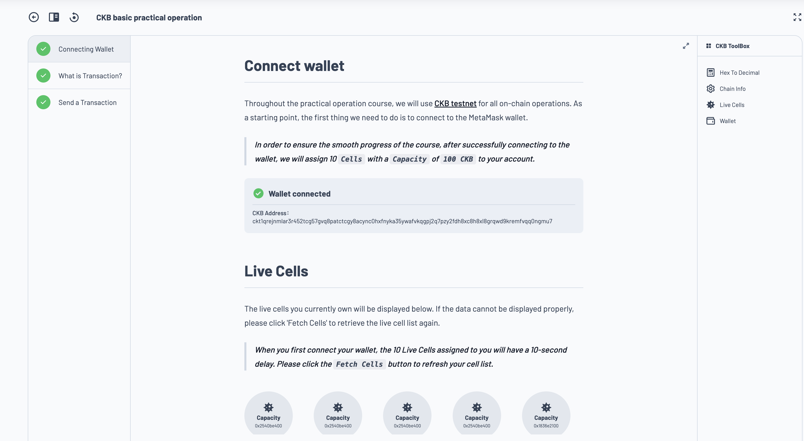
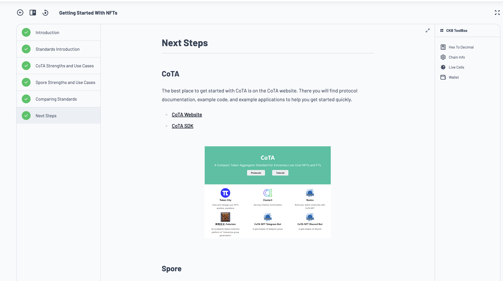

# Builder's Journey - Week 1

Timeline: 11-17 of May, 2026

## Topics Covered

- Dev environment setup
  - [Setup offckb/cli](https://docs.nervos.org/docs/getting-started/quick-start) (TS SDK for building D'apps)
  - Install and run [CKB node for various environments](https://docs.nervos.org/docs/node/node-overview)
- Learned the basic of Nervos CKB from the [CKB Learners guide](https://docs.nervos.org/docs/ckb-fundamentals/nervos-blockchain)
  - Similarities of [CKB VS Bitcoin](https://docs.nervos.org/docs/ckb-fundamentals/ckb-vs-btc)
  - Important differences and upgrades on CKB, compared to Bitcoin, especially around [NC (vs NC-Max) Consensus](https://eprint.iacr.org/2020/1101.pdf)
- How CKB works in summary, following the [How CKB works](https://docs.nervos.org/docs/getting-started/how-ckb-works) guide
- CKB Academy courses
  - Completed lesson 1 -  [CKB Theoretical Knowledge](https://academy.ckb.dev/courses/basic-theory)
    
  - Completed lesson 2 - [CKB Practical Operations](https://academy.ckb.dev/courses/basic-operation)
    
  - Completed lesson 3 - [CKB NFT Standards](https://academy.ckb.dev/courses/nft-getting-started)
    

## Personal Assignment

- Curate article explaining the core concepts of CKB and compare it to Bitcoin chain - *Ongoing*